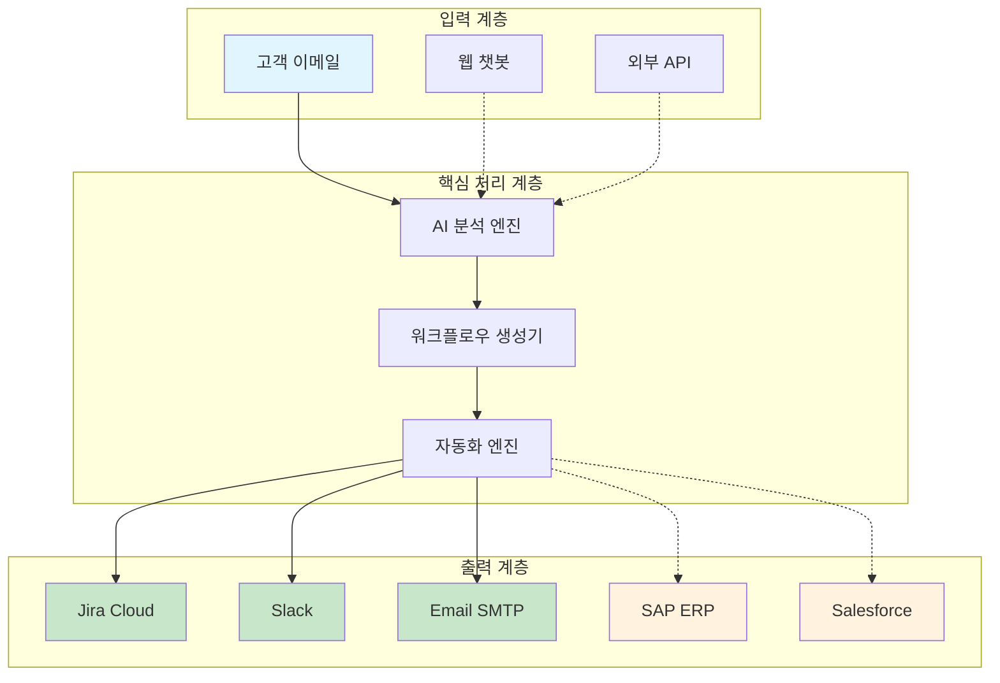
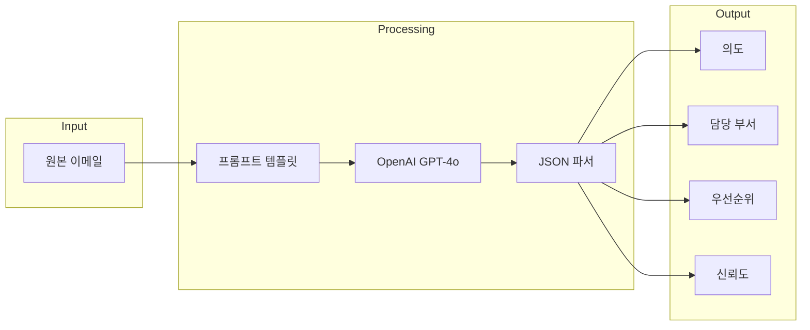
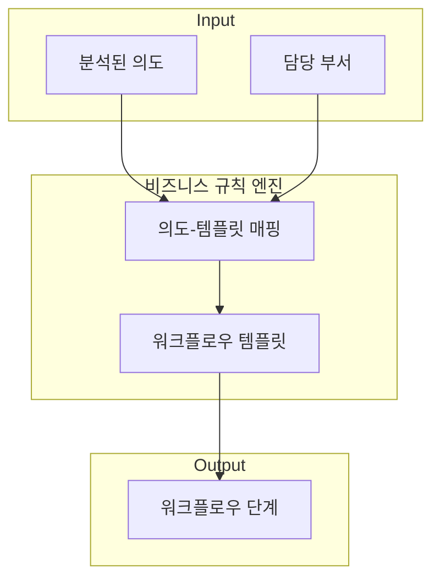
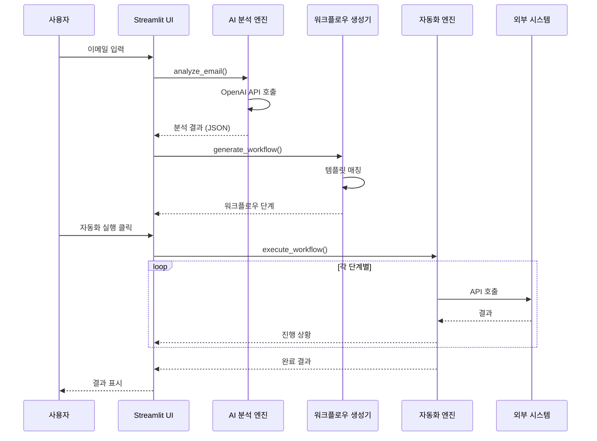
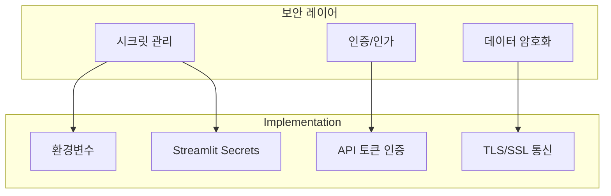

# 시스템 아키텍처

## 개요

AI 워크플로우 오케스트레이터는 **플러그인 아키텍처**를 채택하여 각 컴포넌트가 독립적으로 확장 및 교체 가능하도록 설계되었습니다.

### 핵심 설계 원칙

| 원칙 | 구현 |
|------|------|
| **개방-폐쇄 원칙 (OCP)** | 새 시스템 추가 시 기존 코드 수정 불필요 |
| **의존성 역전 (DIP)** | 추상 베이스 클래스로 결합도 최소화 |
| **단일 책임 (SRP)** | 각 클라이언트가 하나의 시스템만 담당 |
| **레지스트리 패턴** | 런타임 동적 클라이언트 탐색 및 등록 |

---

## 전체 시스템 흐름



> 실선: 현재 구현됨 | 점선: 확장 예정

---

## 컴포넌트 상세

### 1. AI 분석 엔진 (ai_analyzer.py)



**역할:**
- 자연어 이메일을 구조화된 데이터로 변환
- 비즈니스 컨텍스트에 맞는 분류 수행

**핵심 기술:**
- OpenAI Chat Completions API
- JSON 응답 포맷 강제
- 프롬프트 엔지니어링

---

### 2. 워크플로우 생성기 (workflow_generator.py)



**워크플로우 템플릿 구조:**

```python
{
    "refund": {
        "keywords": ["환불", "반품", "파손"],
        "steps": [
            {"action": "지원 티켓 생성", "system": "Jira"},
            {"action": "팀 알림", "system": "Slack"},
            {"action": "CRM 업데이트", "system": "Salesforce"},
        ]
    }
}
```

**설계 원칙:**
- 템플릿 기반으로 확장 용이
- 비즈니스 규칙 분리 (코드 변경 없이 규칙 수정 가능)

---

### 3. 자동화 엔진 (automation_engine.py) - 플러그인 아키텍처

```mermaid
flowchart TB
    subgraph Input
        Steps[워크플로우 단계]
        Config[연동 설정]
    end
    
    subgraph PluginSystem [플러그인 시스템]
        Registry[IntegrationRegistry<br/>클라이언트 레지스트리]
        Base[BaseIntegrationClient<br/>추상 베이스 클래스]
        Decorator[@register_integration<br/>자동 등록 데코레이터]
    end
    
    subgraph Clients [등록된 클라이언트]
        JiraClient[Jira Client]
        SlackClient[Slack Client]
        EmailClient[Email Client]
        SAPClient[SAP Client]
        SFClient[Salesforce Client]
    end
    
    subgraph External [외부 시스템]
        JiraAPI[Jira Cloud API]
        SlackAPI[Slack API]
        SMTP[Gmail SMTP]
        SAPRFC[SAP RFC]
        SFAPI[Salesforce API]
    end
    
    Steps --> Registry
    Config --> Registry
    
    Base --> JiraClient
    Base --> SlackClient
    Base --> EmailClient
    Base --> SAPClient
    Base --> SFClient
    
    Decorator --> Registry
    
    JiraClient --> JiraAPI
    SlackClient --> SlackAPI
    EmailClient --> SMTP
    SAPClient -.-> SAPRFC
    SFClient -.-> SFAPI
    
    style Registry fill:#e8f5e9
    style Base fill:#e8f5e9
    style Decorator fill:#e8f5e9
```

**플러그인 아키텍처 핵심:**

| 컴포넌트 | 역할 | 파일 |
|----------|------|------|
| `BaseIntegrationClient` | 추상 베이스 클래스 | `base.py` |
| `IntegrationRegistry` | 클라이언트 레지스트리 (싱글톤) | `base.py` |
| `@register_integration` | 자동 등록 데코레이터 | `base.py` |

**설계 원칙:**
- **개방-폐쇄 원칙**: 새 시스템 추가 시 기존 코드 수정 불필요
- **의존성 역전**: 추상 베이스 클래스로 결합도 최소화
- **레지스트리 패턴**: 런타임 동적 클라이언트 탐색
- **전략 패턴**: 시뮬레이션/실제 모드 전환

---

## 데이터 흐름



---

## 확장 포인트

### 새로운 시스템 연동 추가 (플러그인 방식)

```python
# services/integrations_mycompany.py

from services.base import BaseIntegrationClient, register_integration, IntegrationResult
from dataclasses import dataclass

@dataclass
class SAPConfig:
    enabled: bool = False
    server_url: str = ""
    # ...

@register_integration("SAP", SAPConfig)  # 이 데코레이터만으로 자동 등록!
class SAPClient(BaseIntegrationClient):
    system_name = "SAP"
    
    def __init__(self, config: SAPConfig):
        self.config = config
    
    def test_connection(self) -> IntegrationResult:
        return IntegrationResult(success=True, message="SAP 연결 성공")
    
    def execute(self, action: str, context: dict) -> IntegrationResult:
        if action == "create_purchase_request":
            # SAP RFC 호출 로직
            return IntegrationResult(success=True, message="PR 생성 완료")
        # ...

# app.py 또는 __init__.py에서 import만 하면 끝!
# import services.integrations_mycompany
```

**장점:** `automation_engine.py` 수정 불필요, 자동으로 새 시스템 인식

### 새로운 입력 채널 추가
```python
class KakaoInputAdapter:
    def parse_message(self, raw_message) -> str:
        return formatted_email
```

### 새로운 워크플로우 템플릿 추가
```python
WORKFLOW_TEMPLATES["procurement"] = {
    "keywords": ["구매", "발주", "입찰"],
    "steps": [
        WorkflowStep(1, "구매 요청서 생성", "SAP", "PR 생성"),
        WorkflowStep(2, "승인 요청", "Email", "결재자에게 알림"),
    ]
}
```

---

## 보안 고려사항



**현재 적용:**
- API 키는 환경변수로 관리 (코드에 하드코딩 X)
- 모든 외부 API 호출은 HTTPS
- 세션 내에서만 인증 정보 유지

**엔터프라이즈 확장 시 고려:**
- HashiCorp Vault 연동
- OAuth 2.0 / SAML SSO
- 감사 로그 (Audit Trail)

---

## 성능 고려사항

| 구간 | 예상 지연 | 최적화 방안 |
|------|----------|------------|
| AI 분석 | 1-3초 | 캐싱, 배치 처리 |
| Jira API | 0.5-1초 | 비동기 처리 |
| Slack API | 0.2-0.5초 | 비동기 처리 |
| 전체 워크플로우 | 3-5초 | 병렬 실행 |

**대용량 처리 시:**
- 메시지 큐 (RabbitMQ, Kafka) 도입
- 워커 프로세스 분리
- 결과 비동기 폴링
