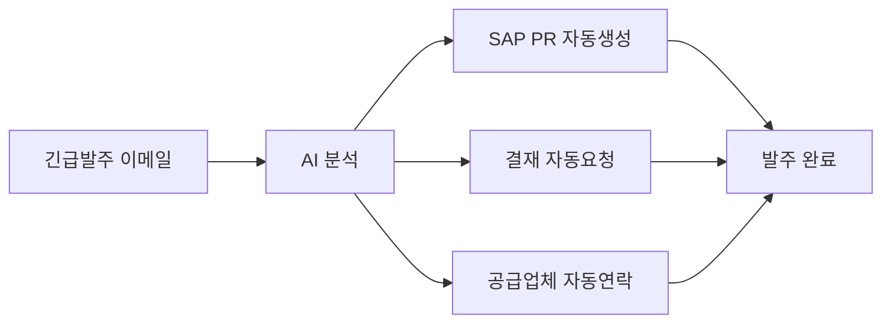

# 비즈니스 시나리오

## 개요

AI 워크플로우 오케스트레이터는 다양한 산업과 업무 영역에서 활용 가능합니다. 
본 문서는 주요 비즈니스 시나리오와 예상 ROI를 제시합니다.

---

## 시나리오 1: 금융사 고객센터

### 현황
- **기업 규모**: 대형 금융지주사 (한국투자금융, BNK금융 등)
- **일일 이메일 유입량**: 500-1,000건
- **담당 인력**: 20명
- **평균 처리 시간**: 이메일당 5분

### 문제점

```
고객 이메일 수신
    ↓
담당자가 수동으로 읽고 분류 (2분)
    ↓
적합한 부서 파악 (1분)
    ↓
내부 시스템에 수동 입력 (2분)
    ↓
Slack/이메일로 팀에 전달 (1분)
```

**총 소요 시간**: 6분/건 × 800건 = **80시간/일**

### AI 솔루션 적용 후

```
고객 이메일 수신
    ↓
AI 자동 분석 (3초)
    ↓
워크플로우 자동 생성 (1초)
    ↓
시스템 자동 연동 (5초)
    ↓
담당자 검토만 필요 (30초)
```

**총 소요 시간**: 40초/건 × 800건 = **9시간/일**

### ROI 분석

| 항목 | Before | After | 절감 |
|------|--------|-------|------|
| 일일 처리 시간 | 80시간 | 9시간 | **89% 감소** |
| 필요 인력 | 20명 | 5명 | **75% 감소** |
| 연간 인건비 | 16억원 | 4억원 | **12억원 절감** |
| 긴급건 누락률 | 5% | 0.1% | **98% 개선** |

---

## 시나리오 2: 제조업 구매팀

### 현황
- **기업 규모**: 대형 제조사 (현대모비스, 포스코 등)
- **월간 구매요청 건수**: 2,000건
- **긴급 발주 비율**: 15%
- **평균 발주 리드타임**: 3일

### 문제점

1. **이메일 기반 요청**: 생산팀에서 이메일로 긴급 발주 요청
2. **수동 SAP 입력**: 구매팀이 SAP에 수동으로 PR 생성
3. **승인 지연**: 결재 요청을 별도로 진행
4. **공급업체 연락**: 수동으로 납기 확인

### AI 솔루션 적용



### ROI 분석

| 항목 | Before | After | 개선 |
|------|--------|-------|------|
| 긴급발주 처리시간 | 4시간 | 30분 | **87% 단축** |
| 재고 부족 발생 | 월 5건 | 월 0.5건 | **90% 감소** |
| 라인 정지 손실 | 월 2억원 | 월 2천만원 | **90% 절감** |

---

## 시나리오 3: IT 헬프데스크

### 현황
- **기업 규모**: 대기업 IT부서 (한국전력, 포스코 등)
- **일일 IT 문의**: 200건
- **평균 해결 시간**: P1 2시간, P2 8시간

### 문제점

1. 사용자가 이메일로 장애 신고
2. 헬프데스크가 수동 분류
3. ServiceNow에 수동 입력
4. 담당자 수동 배정
5. 해결까지 커뮤니케이션 지연

### AI 솔루션 적용

- **자동 우선순위 분류**: P1/P2/P3 자동 판정
- **영향도 분석**: 영향받는 시스템/사용자 자동 파악
- **자동 에스컬레이션**: SLA 기반 자동 상위 보고

### ROI 분석

| 항목 | Before | After | 개선 |
|------|--------|-------|------|
| P1 대응시간 | 2시간 | 30분 | **75% 단축** |
| MTTR | 8시간 | 4시간 | **50% 단축** |
| SLA 준수율 | 85% | 98% | **15%p 개선** |

---

## 시나리오 4: 컨설팅 영업

### 현황
- **기업 규모**: Big 4 컨설팅펌
- **월간 RFP 수신**: 50건
- **제안서 작성 기간**: 2-4주

### 문제점

1. RFP 이메일 수신 후 확인 지연
2. 담당 파트너 배정에 1-2일 소요
3. 제안팀 구성에 추가 시간 소요
4. 고객 응답 지연으로 신뢰도 저하

### AI 솔루션 적용

```
RFP 이메일 수신
    ↓
AI가 RFP 내용 분석 (산업, 규모, 예산, 기한)
    ↓
Salesforce에 Opportunity 자동 생성
    ↓
적합한 파트너/매니저에게 즉시 알림
    ↓
24시간 내 고객에게 수신 확인 자동 발송
```

### ROI 분석

| 항목 | Before | After | 개선 |
|------|--------|-------|------|
| 초기 응답 시간 | 48시간 | 2시간 | **96% 단축** |
| 제안 참여율 | 70% | 95% | **36% 증가** |
| Win Rate | 25% | 32% | **28% 증가** |

---

## 종합 ROI 모델

### 비용 요소

| 항목 | 예상 비용 |
|------|----------|
| 개발 비용 (1회성) | 5,000만원 |
| 운영 비용 (연간) | 1,200만원 |
| OpenAI API (연간) | 600만원 |
| **총 1년차 비용** | **6,800만원** |

### 절감 효과 (연간)

| 시나리오 | 연간 절감액 |
|----------|-----------|
| 금융 고객센터 | 12억원 |
| 제조업 구매 | 2억원 |
| IT 헬프데스크 | 1억원 |
| 컨설팅 영업 | 5억원 |

### 투자 회수 기간

- **ROI**: 2,900% (1년 기준)
- **투자 회수**: **3주**

---

## 핵심 성공 요소

1. **정확한 AI 분류**: 95% 이상의 분류 정확도 달성
2. **시스템 연동**: 기존 엔터프라이즈 시스템과의 안정적 연동
3. **예외 처리**: AI가 확신하지 못하는 케이스의 수동 처리 프로세스
4. **지속적 개선**: 사용자 피드백 기반 모델 튜닝

---

## 구현 로드맵

### Phase 1 (1-2개월)
- PoC 개발 및 파일럿 테스트
- 주요 시나리오 3개 선정

### Phase 2 (3-4개월)
- 프로덕션 환경 구축
- 기존 시스템 연동

### Phase 3 (5-6개월)
- 전사 롤아웃
- 추가 시나리오 확장
