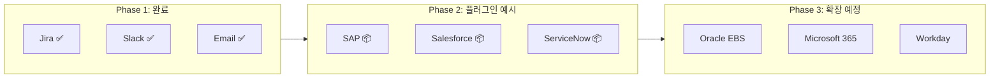

# 확장 가이드

## 개요

AI 워크플로우 오케스트레이터는 **플러그인 아키텍처**를 채택하여 새로운 시스템 연동을 **코드 수정 없이** 추가할 수 있습니다.

---

## 🔌 플러그인 아키텍처

### 핵심 구성요소

```
┌─────────────────────────────────────────────────────────────────┐
│                    services/base.py                              │
│  ┌─────────────────────┐  ┌─────────────────────────────────┐   │
│  │ BaseIntegrationClient│  │    IntegrationRegistry          │   │
│  │  (추상 베이스 클래스)  │  │    (클라이언트 레지스트리)       │   │
│  └─────────────────────┘  └─────────────────────────────────┘   │
│             ▲                            ▲                       │
│             │ 상속                       │ 등록                  │
│  ┌──────────┴──────────────────────────────┴──────────────────┐ │
│  │              @register_integration 데코레이터               │ │
│  └─────────────────────────────────────────────────────────────┘ │
└─────────────────────────────────────────────────────────────────┘
                              │
         ┌────────────────────┼────────────────────┐
         ▼                    ▼                    ▼
   ┌──────────┐         ┌──────────┐         ┌──────────┐
   │JiraClient│         │SlackClient│        │EmailClient│  기본
   └──────────┘         └──────────┘         └──────────┘
         │                    │                    │
         ▼                    ▼                    ▼
   ┌──────────┐         ┌──────────┐         ┌──────────┐
   │SAPClient │         │SalesforceClient    │ServiceNowClient   플러그인
   └──────────┘         └──────────┘         └──────────┘
```

### 새 시스템 추가 (3단계)

```python
# services/integrations_mycompany.py

from services.base import (
    BaseIntegrationClient, 
    BaseConfig,
    IntegrationResult, 
    register_integration
)
from dataclasses import dataclass

# 1단계: 설정 클래스 정의
@dataclass
class MySystemConfig(BaseConfig):
    enabled: bool = False
    api_url: str = ""
    api_key: str = ""
    
    def is_valid(self) -> bool:
        return self.enabled and bool(self.api_url) and bool(self.api_key)
    
    def get_validation_errors(self) -> list[str]:
        errors = []
        if not self.api_url:
            errors.append("API URL이 필요합니다")
        if not self.api_key:
            errors.append("API 키가 필요합니다")
        return errors

# 2단계: 클라이언트 구현 + 등록
@register_integration("MySystem", MySystemConfig)
class MySystemClient(BaseIntegrationClient):
    system_name = "MySystem"
    
    def __init__(self, config: MySystemConfig):
        self.config = config
    
    @classmethod
    def get_supported_actions(cls) -> list[str]:
        return ["create_record", "update_record", "test_connection"]
    
    def test_connection(self) -> IntegrationResult:
        # 연결 테스트 구현
        return IntegrationResult(success=True, message="연결 성공")
    
    def execute(self, action: str, context: dict) -> IntegrationResult:
        # 액션별 실행 로직
        if action == "create_record":
            return self._create_record(context)
        # ...

# 3단계: import만 하면 자동 등록!
# app.py 또는 __init__.py에서:
# import services.integrations_mycompany
```

**끝!** 이제 `AutomationEngine`이 자동으로 `MySystem`을 인식하고 실행합니다.

---

## 엔터프라이즈 시스템 연동 로드맵

### 구현 현황

| 시스템 | 상태 | 용도 | 파일 |
|--------|------|------|------|
| Jira Cloud | ✅ 실제 연동 | 티켓/이슈 관리 | `integrations.py` |
| Slack | ✅ 실제 연동 | 실시간 알림 | `integrations.py` |
| Gmail SMTP | ✅ 실제 연동 | 이메일 발송 | `integrations.py` |
| SAP | 📦 플러그인 예시 | ERP 연동 | `integrations_enterprise.py` |
| Salesforce | 📦 플러그인 예시 | CRM 연동 | `integrations_enterprise.py` |
| ServiceNow | 📦 플러그인 예시 | ITSM 연동 | `integrations_enterprise.py` |

### 로드맵



---

## SAP 연동 가이드

### 대상 고객
- 제조업 (현대자동차, 포스코, 한화 등)
- 유통업
- 에너지/화학

### 연동 시나리오

**시나리오 1: 구매 요청 자동화**
```
공급업체 송장 이메일 수신
→ AI가 송장 정보 추출 (금액, 품목, 업체)
→ SAP에 구매 요청(PR) 자동 생성
→ 승인권자에게 알림
```

**시나리오 2: 재고 문의 자동 응답**
```
고객 재고 문의 이메일
→ SAP에서 실시간 재고 조회
→ 자동 회신 이메일 생성
```

### 기술 구현

```python
# services/integrations_sap.py

class SAPClient:
    """SAP RFC/OData 클라이언트"""
    
    def __init__(self, config: SAPConfig):
        self.config = config
        # SAP RFC 연결 설정 (pyrfc 라이브러리 사용)
        self.connection = Connection(
            ashost=config.host,
            sysnr=config.system_number,
            client=config.client,
            user=config.user,
            passwd=config.password
        )
    
    def create_purchase_requisition(
        self,
        material: str,
        quantity: int,
        vendor: str
    ) -> IntegrationResult:
        """구매 요청(PR) 생성"""
        try:
            result = self.connection.call(
                'BAPI_PR_CREATE',
                PRITEM=[{
                    'MATERIAL': material,
                    'QUANTITY': quantity,
                    'VENDOR': vendor
                }]
            )
            pr_number = result['PRITEM'][0]['PREQ_NO']
            return IntegrationResult(
                success=True,
                message=f"PR 생성 완료: {pr_number}",
                data={"pr_number": pr_number}
            )
        except Exception as e:
            return IntegrationResult(
                success=False,
                message=f"SAP 오류: {str(e)}"
            )
    
    def get_inventory(self, material: str, plant: str) -> IntegrationResult:
        """재고 조회"""
        # BAPI_MATERIAL_STOCK_REQ_LIST 호출
        pass
```

### 필요 의존성

```
# requirements.txt 추가
pyrfc>=2.8.0  # SAP RFC 연결
```

---

## Salesforce 연동 가이드

### 대상 고객
- 금융 (영업/고객관리)
- B2B 서비스업
- 컨설팅

### 연동 시나리오

**시나리오 1: 리드 자동 등록**
```
영업 문의 이메일
→ AI가 회사명, 담당자, 요구사항 추출
→ Salesforce에 Lead 자동 생성
→ 영업팀 알림
```

**시나리오 2: 케이스 자동 생성**
```
고객 불만 이메일
→ AI 감정 분석 + 긴급도 판단
→ Salesforce Case 생성
→ 담당자 자동 배정
```

### 기술 구현

```python
# services/integrations_salesforce.py

from simple_salesforce import Salesforce

class SalesforceClient:
    """Salesforce REST API 클라이언트"""
    
    def __init__(self, config: SalesforceConfig):
        self.sf = Salesforce(
            username=config.username,
            password=config.password,
            security_token=config.security_token,
            domain='login'  # 또는 'test' (sandbox)
        )
    
    def create_lead(
        self,
        company: str,
        name: str,
        email: str,
        description: str
    ) -> IntegrationResult:
        """리드 생성"""
        try:
            result = self.sf.Lead.create({
                'Company': company,
                'LastName': name,
                'Email': email,
                'Description': description,
                'LeadSource': 'AI Workflow'
            })
            return IntegrationResult(
                success=True,
                message=f"리드 생성 완료: {result['id']}",
                data={"lead_id": result['id']}
            )
        except Exception as e:
            return IntegrationResult(
                success=False,
                message=f"Salesforce 오류: {str(e)}"
            )
    
    def create_case(
        self,
        subject: str,
        description: str,
        priority: str,
        account_id: str = None
    ) -> IntegrationResult:
        """케이스 생성"""
        try:
            result = self.sf.Case.create({
                'Subject': subject,
                'Description': description,
                'Priority': priority,
                'Origin': 'AI Workflow',
                'AccountId': account_id
            })
            return IntegrationResult(
                success=True,
                message=f"케이스 생성 완료: {result['id']}",
                data={"case_id": result['id']}
            )
        except Exception as e:
            return IntegrationResult(
                success=False,
                message=f"Salesforce 오류: {str(e)}"
            )
```

### 필요 의존성

```
# requirements.txt 추가
simple-salesforce>=1.12.0
```

---

## ServiceNow 연동 가이드

### 대상 고객
- IT서비스 기업
- 대기업 IT부서
- 금융권 (IT운영)

### 연동 시나리오

**시나리오: IT 헬프데스크 자동화**
```
기술 문의 이메일
→ AI가 카테고리, 긴급도 분류
→ ServiceNow Incident 생성
→ 적합한 기술 팀에 배정
→ SLA 타이머 시작
```

### 기술 구현

```python
# services/integrations_servicenow.py

import requests

class ServiceNowClient:
    """ServiceNow REST API 클라이언트"""
    
    def __init__(self, config: ServiceNowConfig):
        self.instance = config.instance  # e.g., 'company.service-now.com'
        self.auth = (config.username, config.password)
        self.base_url = f"https://{self.instance}/api/now"
    
    def create_incident(
        self,
        short_description: str,
        description: str,
        urgency: int = 2,
        impact: int = 2,
        assignment_group: str = None
    ) -> IntegrationResult:
        """인시던트 생성"""
        try:
            url = f"{self.base_url}/table/incident"
            payload = {
                'short_description': short_description,
                'description': description,
                'urgency': urgency,
                'impact': impact,
                'assignment_group': assignment_group
            }
            response = requests.post(
                url,
                auth=self.auth,
                json=payload,
                headers={'Content-Type': 'application/json'}
            )
            
            if response.status_code == 201:
                data = response.json()['result']
                return IntegrationResult(
                    success=True,
                    message=f"인시던트 생성: {data['number']}",
                    data={"incident_number": data['number']}
                )
            else:
                return IntegrationResult(
                    success=False,
                    message=f"ServiceNow 오류: {response.text}"
                )
        except Exception as e:
            return IntegrationResult(
                success=False,
                message=f"연결 오류: {str(e)}"
            )
```

---

## Microsoft 365 연동 가이드

### 대상 고객
- 전 산업 (M365 사용 기업)

### 연동 시나리오

**시나리오: 아웃룩 이메일 + Teams 알림**
```
Outlook 메일함 모니터링
→ 새 이메일 AI 분석
→ Microsoft Teams 채널 알림
→ Planner 태스크 생성
```

### 기술 구현

```python
# services/integrations_microsoft.py

from msal import ConfidentialClientApplication
import requests

class MicrosoftGraphClient:
    """Microsoft Graph API 클라이언트"""
    
    def __init__(self, config: MicrosoftConfig):
        self.app = ConfidentialClientApplication(
            config.client_id,
            authority=f"https://login.microsoftonline.com/{config.tenant_id}",
            client_credential=config.client_secret
        )
        self.token = None
    
    def _get_token(self):
        result = self.app.acquire_token_for_client(
            scopes=["https://graph.microsoft.com/.default"]
        )
        self.token = result['access_token']
    
    def send_teams_message(
        self,
        team_id: str,
        channel_id: str,
        message: str
    ) -> IntegrationResult:
        """Teams 채널에 메시지 전송"""
        self._get_token()
        url = f"https://graph.microsoft.com/v1.0/teams/{team_id}/channels/{channel_id}/messages"
        
        response = requests.post(
            url,
            headers={
                'Authorization': f'Bearer {self.token}',
                'Content-Type': 'application/json'
            },
            json={'body': {'content': message}}
        )
        
        if response.status_code == 201:
            return IntegrationResult(success=True, message="Teams 메시지 전송 완료")
        else:
            return IntegrationResult(success=False, message=f"Teams 오류: {response.text}")
```

### 필요 의존성

```
# requirements.txt 추가
msal>=1.24.0
```

---

## 새로운 연동 추가 체크리스트

### Before (기존 방식) vs After (플러그인 방식)

| 단계 | Before (4-5개 파일 수정) | After (1개 파일 생성) |
|------|--------------------------|----------------------|
| 설정 클래스 | config.py 수정 | 새 파일에 정의 ✅ |
| 클라이언트 | integrations.py 수정 | 새 파일에 정의 ✅ |
| 엔진 등록 | automation_engine.py 수정 | **자동** 🎉 |
| 핸들러 | automation_engine.py 수정 | **자동** 🎉 |

### 플러그인 방식 체크리스트

- [ ] `services/integrations_xxx.py` 파일 생성
- [ ] `BaseConfig` 상속하여 설정 클래스 정의
- [ ] `BaseIntegrationClient` 상속하여 클라이언트 구현
- [ ] `@register_integration` 데코레이터 적용
- [ ] 모듈 import 추가 (app.py 또는 __init__.py)
- [ ] (선택) UI 설정 페이지 추가

### 필수 구현 메서드

```python
class MyClient(BaseIntegrationClient):
    system_name = "MySystem"  # 필수: 시스템 이름
    
    def __init__(self, config):          # 필수: 초기화
        ...
    
    def test_connection(self):           # 필수: 연결 테스트
        return IntegrationResult(...)
    
    def execute(self, action, context):  # 필수: 액션 실행
        return IntegrationResult(...)
    
    @classmethod
    def get_supported_actions(cls):      # 선택: 지원 액션 목록
        return ["action1", "action2"]
```

---

## 산업별 확장 시나리오

### 금융권

| 시스템 | 용도 | 규제 고려 |
|--------|------|----------|
| 코어뱅킹 | 계좌 조회/이체 | 금융감독원 규정 |
| AML 시스템 | 의심 거래 보고 | 자금세탁방지법 |
| CRM | 고객 정보 관리 | 개인정보보호법 |

### 제조업

| 시스템 | 용도 |
|--------|------|
| SAP ERP | 구매/생산/재고 |
| MES | 생산 실행 |
| PLM | 제품 수명주기 |
| SCM | 공급망 관리 |

### 공공기관

| 시스템 | 용도 | 규제 고려 |
|--------|------|----------|
| 전자결재 | 문서 승인 | 전자정부법 |
| 민원 시스템 | 민원 접수/처리 | 민원처리법 |
| 인사 시스템 | HR 관리 | 공무원법 |
